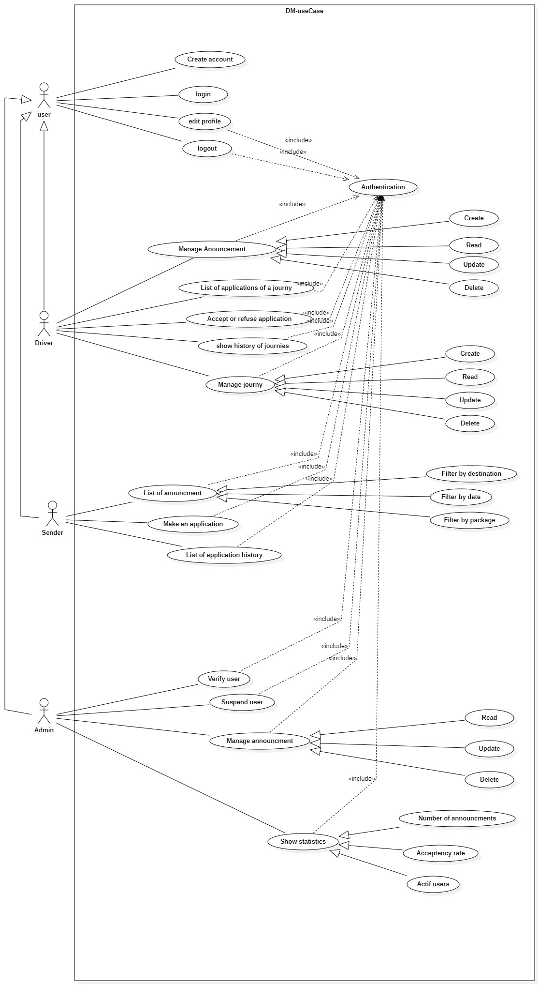
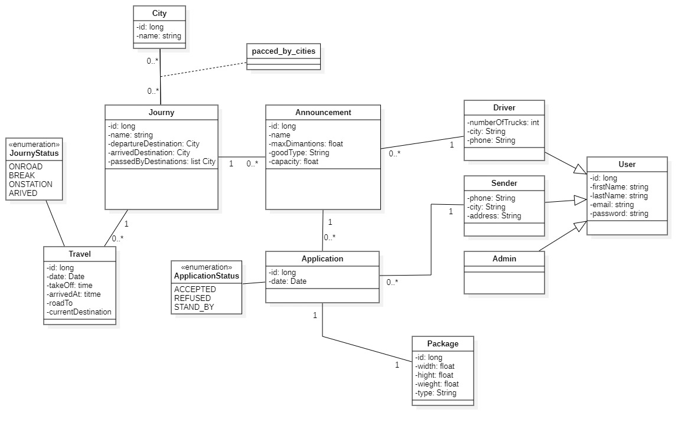
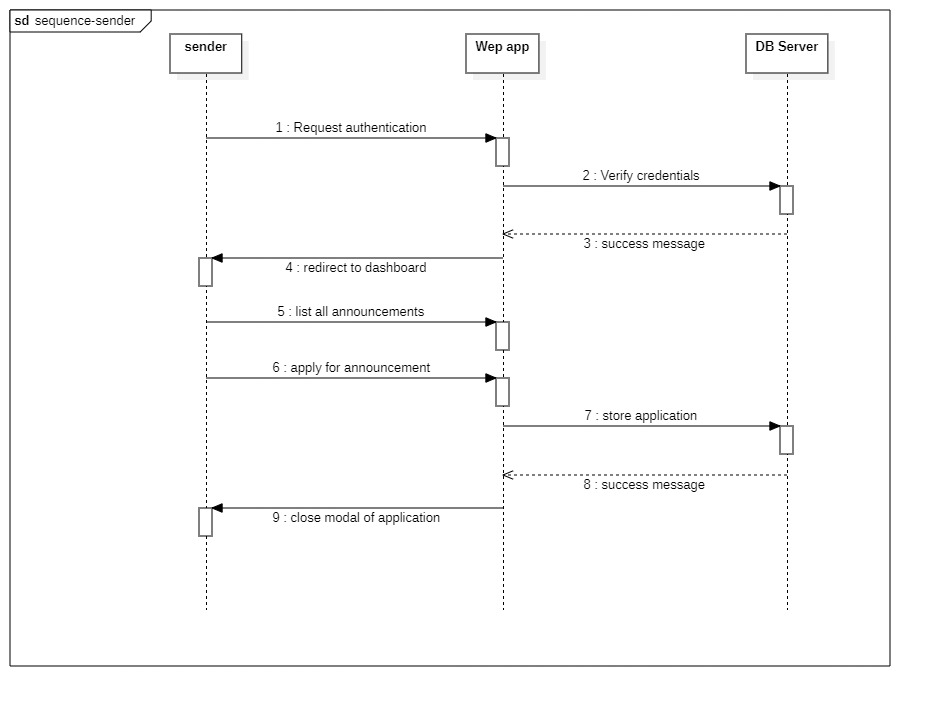
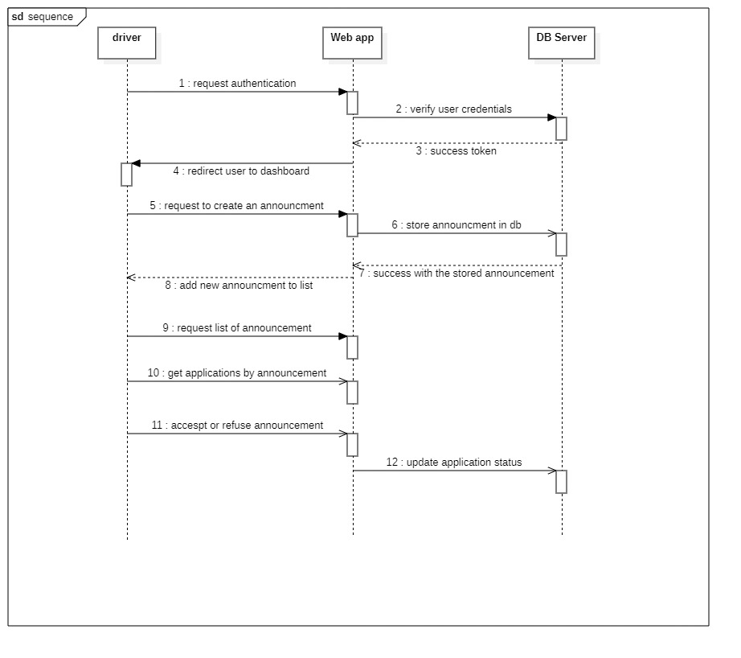

# 🚚 Delivery Matcher Platform

A web platform that connects **senders** and **drivers** for secure and efficient package delivery. It offers personalized dashboards for each user type and an admin panel for platform management and monitoring.

---

## 📌 Features by User Role

### 👤 User
- Create an account by providing first name, last name, email, and password.
- Log in securely.
- Edit personal information to keep the profile up to date.
- Log out to protect personal data.

### 🚗 Driver
- Post a travel announcement with the following details:
    - Departure location, intermediate stops, final destination.
    - Maximum allowed package dimensions.
    - Type of goods and available capacity.
- View delivery requests linked to posted trips.
- Accept or reject delivery requests based on preferences or available space.
- View the history of trips and transported packages.

### 📦 Sender
- Browse available trip announcements that match search criteria:
    - Destination, date, type of package.
- Submit a delivery request including package details:
    - Dimensions, weight, and type.
- View the history of delivery requests and shipped packages.

### 🛠️ Administrator
- Access a management dashboard with platform-wide information:
    - Users, announcements, and requests.
- Approve, suspend, or mark a user as “Verified” after identity validation.
- View, edit, or delete announcements posted by drivers.
- Monitor platform performance through statistics and charts using **Chart.js**:
    - Number of announcements, acceptance rate, active users, etc.

---

## 🧩 UML Diagrams

### ✅ Use Case Diagram

### 🏛️ Class Diagram

### 🔄 Sender Sequence Diagram

### 🔄 Driver Sequence Diagram

---

## 🛠️ Technologies Used

| Layer           | Technology              |
|----------------|--------------------------|
| **Backend**     | [Spring Boot](https://spring.io/projects/spring-boot) |
| **Frontend**    | [Angular](https://angular.io/) + [Tailwind CSS](https://tailwindcss.com/) |
| **Database**    | [MySQL](https://www.mysql.com/) |
| **Charts**      | [Chart.js](https://www.chartjs.org/) |
| **UML Design**  | StarUML / Lucidchart / Draw.io |

## links: 
**API** [Postman](https://web.postman.co/workspace/My-Workspace~613763ab-1af0-4e3d-87b9-4fde1d40207c/collection/4121566-c111a779-1e0c-472e-81d4-4deb92dd217e?action=share&source=copy-link&creator=4121566)